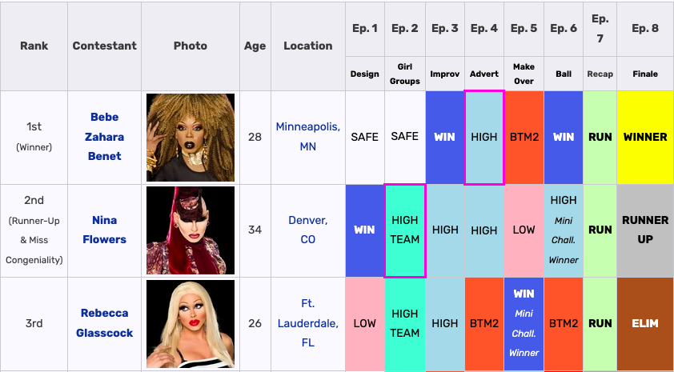
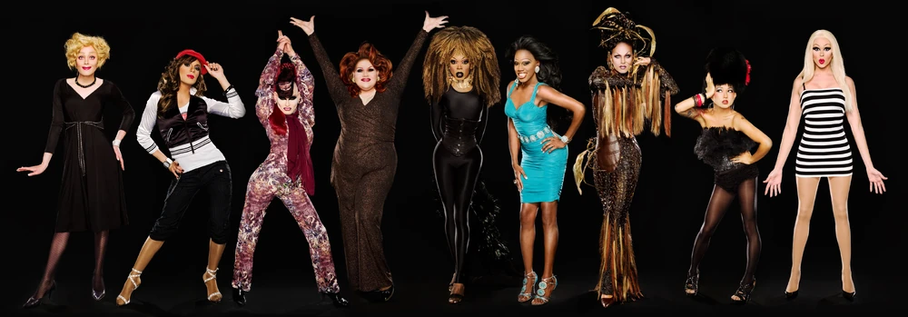
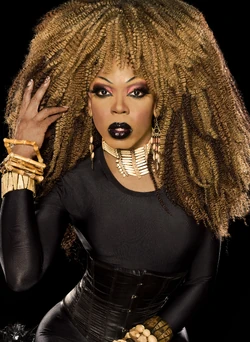

# Entrega 01: ¿Cómo ganar Ru Paul's Drag Race?
### Nicolás Bossy, Belén Navarro, Renata Velásquez

**Síntesis del proyecto**: Respecto a lo visto en la serie RuPaul’s Drag Race y los resultados de todas la temporadas de la serie regular americana, queremos buscar las características comunes que unen a las ganadoras y encontrar la clave para ganar Drag Race.

**Hipotesis**: Hay una serie de características que une a las ganadoras de RuPaul’s Drag Race y puede asegurar la victoria dentro del programa de competencias. 

**Antecedentes**: Existe una guía publicada por la revista Vulture que habla sobre los diferentes tips de cómo ganar la serie, pero no existe un análisis cuantitativo que permita dar certezas de las características de una ganadora de Drag Race.

[ARTÍCULO DE GUÍA VULTURE](https://www.vulture.com/2017/03/rupauls-drag-race-how-to-win-guide.html) 

**Datos**: Existe un registro en la página de FandomWikia de RuPaul’s DragRace, que cuenta con los resultados de cada una de las participantes, sus posiciones en los episodios, cuando son eliminadas y sus perdidas/victorias. Están considerados en esta página las series regulares y todos los spin-offs en otros países. En otras palabras, los datos se pueden recopilar y ordenar para la investigación.

 

[EJEMPLO DE DATOS RECOPILADOS POR FANDOM](https://rupaulsdragrace.fandom.com/wiki/RuPaul%27s_Drag_Race_(Season_1))

En esta página no tan solo se encuentra la información de quienes ganan el episodio, sino cuál fue la temática del episodio. En la serie existen un grupo de *Challenges* icónicos que tienden a relacionarse con la victoria o pérdida de la corona, los cuales juntaremos para ver relaciones entre, por ejemplo, ganar el Snatch Game y si esto influye en el resultado final de la serie de cada competidora. 
Todos estos datos son públicos, mientras que los episodios de la serie se encuentran bajo suscripciones, pero se pueden encontrar en páginas alternativas.  

**Preguntas por responder** : Con estos datos antes mencionados, al cruzarlos y ver también contenidos visuales de la serie, creemos se puede llegar a comprobar o negar nuestra hipótesis.

*EJEMPLOS*

1.⁠ ⁠¿Cuáles son las características más comunes entre las ganadoras de RuPaul’s Drag Race?

 2.⁠ ⁠¿Existen patrones en el desempeño de las ganadoras a lo largo de la competencia?

 3.⁠ ⁠¿Ganar ciertos desafíos icónicos, como el Snatch Game, influye en la posibilidad de ganar la competencia?

 4.⁠ ⁠¿Cuántas veces han estado en el bottom las ganadoras antes de coronarse?

 5.⁠ ⁠¿Las ganadoras han tenido un desempeño constante o han tenido altibajos en la competencia?

 6.⁠ ⁠¿Es más probable que una ganadora haya ganado el primer episodio de la temporada?

 7.⁠ ⁠¿Cuáles son las tendencias en términos de estilos de drag, personalidad o estrategias que se observan en las ganadoras?

 9.⁠ ⁠¿La cantidad de victorias en desafíos semanales es un indicador fuerte de éxito en la competencia?

**Historia Visual**

 Idealmente, nos gustaría basarnos en la estética de *The Pudding*, con la lógica del scrolling y las imágenes que se mantienen en la pantalla mientras la historia progresa. Queremos usar los colores e īconos de la serie, que cuenta con una estética clara que es difícil de separar de la identidad de Drag Race y nos gustaría preservar. 

Cada temporada cuenta con photoshoots promocionales, tanto de todo el cast como de cada una de las drag queens. Aquí hay un ejemplo de la primera temporada, acompañada de un Mug Shot de su ganadora, Bebe Zahara Benet. 

 

 

# **Resultados**

- Lo mínimo que buscamos lograr es comprobar o negar nuestra hipótesis, para saber si existen elementos indispensables para ganar Drag Race. Como máximo, nos gustaría ver cuáles son las relaciones entre distintos desafíos y su relevancia para ganar o perder Drag Race, qué permite a una reina ganar Miss Congeniality y que tienen en común las ganadoras de este premio agregado, y, si existe posibilidad, avanzar con los datos de All Stars, un spin off de la serie original en que reinas de las temporada anteriores compiten de nuevo para una oportunidad más de victoria.

