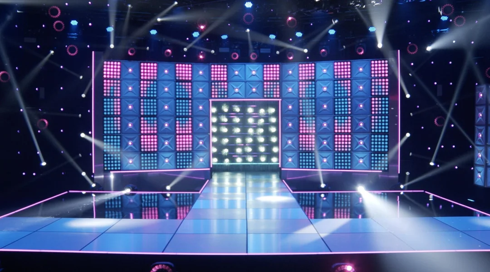

## Presentación de tema 
 
Ru Paul’s Drag Race es un programa de competencias entre transformistas o drag queens, es decir, personajes (en el caso del show, femeninos) que cobran vida a través de las drag queens, quienes a lo largo del show participan en una variedad de desafíos o Maxi Challenges para probar su “Charisma, Uniqueness, Nerve and Talent”, características indispensables para el éxito en el mundo del drag y en el show.

El show documenta a la transformista superestrella RuPaul, en su búsqueda de la próxima estrella del drag. RuPaul hace de host, mentora y jueza principal dentro de la serie. Las competencias que se llevan a cabo en el show son diferentes cada semana y el panel de jueces está conformado por 4 personas, entre las que se incluye un invitado de la semana, pero RuPaul siempre se ve acompañada de Michelle Visage, Carson Kressley o Ross Matthews. Además de Maxi Challenges, cada episodio se ve acompañado de una pasarela, muchas veces temática en referencia a íconos pop como Madonna, Lady Gaga, o la misma RuPaul.
 

En cada episodio una reina gana y otra es eliminada. Esto se determina en base a las críticas de los jueces y, en el caso de las dos peor evaluadas, se pasa a un Lip Sync for your Life, donde las reinas hacen lipsync de una canción designada y quien gana logra mantenerse en el programa, mientras que la perdedora se va y deja un mensaje escrito con labial en el espejo en que se alistan antes de pasar al escenario principal. 
 

### Hipótesis 
Hay una serie de características que une a las ganadoras de RuPaul’s Drag Race y puede asegurar la victoria dentro del programa de competencias. 

### Preguntas de investigación 
1.⁠ ⁠¿Cuáles son las características más comunes entre las ganadoras de RuPaul’s Drag Race?

 2.⁠ ⁠¿Existen patrones en el desempeño de las ganadoras a lo largo de la competencia?

 3.⁠ ⁠¿Ganar ciertos desafíos icónicos, como el Snatch Game, influye en la posibilidad de ganar la competencia?

 4.⁠ ⁠¿Cuántas veces han estado en el bottom las ganadoras antes de coronarse?

 5.⁠ ⁠¿Las ganadoras han tenido un desempeño constante o han tenido altibajos en la competencia?

 6.⁠ ⁠¿Es más probable que una ganadora haya ganado el primer episodio de la temporada?

 7.⁠ ⁠¿Cuáles son las tendencias en términos de estilos de drag, personalidad o estrategias que se observan en las ganadoras?

 9.⁠ ⁠¿La cantidad de victorias en desafíos semanales es un indicador fuerte de éxito en la competencia?

### Avance del proyecto 
Con nuestras bases de datos hemos podido encontrar distintos tipos de similitudes entre las ganadoras de la serie y la serie en si misma. 
Al ver la base de datos del desempeño de las competidoras en los distintos episodios de sus respectivas temporadas, encontramos que existen grupos de desafíos que se mantienen persistentes a lo largo de todo el show: **actuación, diseño, ad, los ball** (que cuentan con un total de 3 looks que se presentan en la pasarela) **desafíos de diseño y el icónico Snatch Game**. Todos estos desafíos se ven presenten en casi todas las temporadas, faltando en algunos porque se han ido incluyendo con el paso del tiempo, como es el caso de Snatch Game, que comenzó en la segunda temporada de Drag Race. A pesar de esto, se pueden categorizar posteriormente todos estos tipos de desafíos para llegar a una conclusión sobre las fortalezas de cada reina. 

### Resumen de la historia actual 
