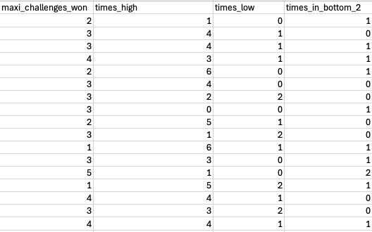
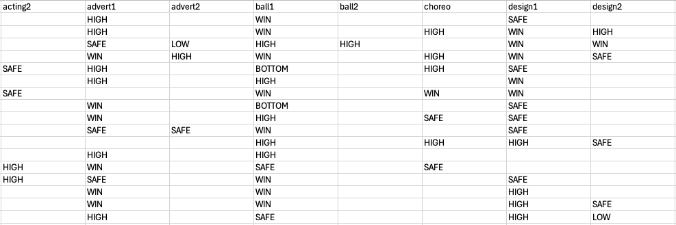
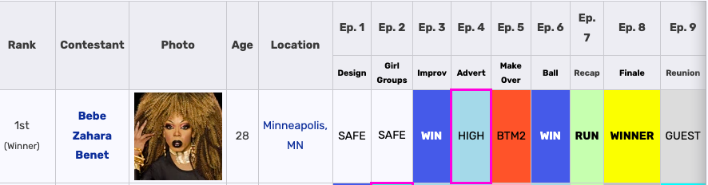

## DOCUMENTACIÓN 
El proceso de encontrar los datos para la tabla comienza en la página [Drag Race Wiki ](https://rupaulsdragrace.fandom.com/wiki/RuPaul%27s_Drag_Race), donde se puede encontrar información de todas las temporadas de la serie original de Rupaul's Drag Race, sino que también todos los spin-offs internacionales que han nacido de esta serie. 
Drag Race Wiki es creado por los fans, y es por esto que cuenta con información recopilada por ellos que, habiendo visto la serie más de una vez, puedo asegurar es verídica y objetiva. Esto es ya que en cada episodio podemos ver las posiciones de las reinas y su desempeño, si **ganan**, quedan en una **posición alta**, simplemente continúan **safe**, quedan **bajo** o se van a lip sync - lo que aplica para el **bottom 2** -.
Creé una base de datos basándome en la información que se encuentra en la página, ya que existe un orden muy estructurado que permite organizar los datos para un análisis que coincida con el objetivo que tenemos: encontrar y retratar a la ganadora de RuPaul's Drag Race idónea, si es que esta existe. 
### 1. ORDEN 
Lo primero que hice originalmente fue agregar los nombres de cada reina, su temporada respectiva, y ciudad de origen. Además, conté los WINS y BOTTOM 2 desde la temporada 1 a la 17, sumando cada uno de estos aspectos y ordenándolos de la siguiente forma: 
 
Como se ve en la imagen, evalué la precisión de los datos y consideré necesario agregar los otros tipos de posiciones, evitando los SAFE, ya que esta posición no muestra fallas ni aciertos mayores. 

### 2. REORDENAMIENTO 
Además de esto, originalemente cometí el error de agregar más de un dato al categorizar los tipos de desafíos que ganan o pierden las reinas en una misma celda. Después de consultar con mi ayudante, hice un reordenamiento de los datos en la siguiente forma: 

 

Esta organización comprensiva incluye la información que se encuentra en la página de Drag Race Wiki, usando como base los datos que se organizan en este caso en orden episódico. Abajo va un ejemplo basado en el desempeño de la primera ganadora, Bebe Zahara Benet: 
 
Podemos ver que en esta gráfica se describe la temática de cada episodio y la posición de Bebe en cada uno de ellos. En mi gráfico, ordené por desafío en orden alfabético, usando cada una de las temporadas de la serie. Cabe destacar que a lo largo de la serie surgen nuevos tipos de desafíos o un tipo de desafío se realiza más de una vez, por lo mismo existe acting1 y acting2 y así con el resto de las categorías. 

